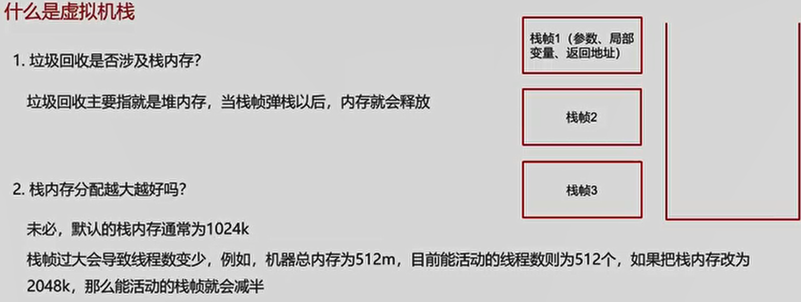
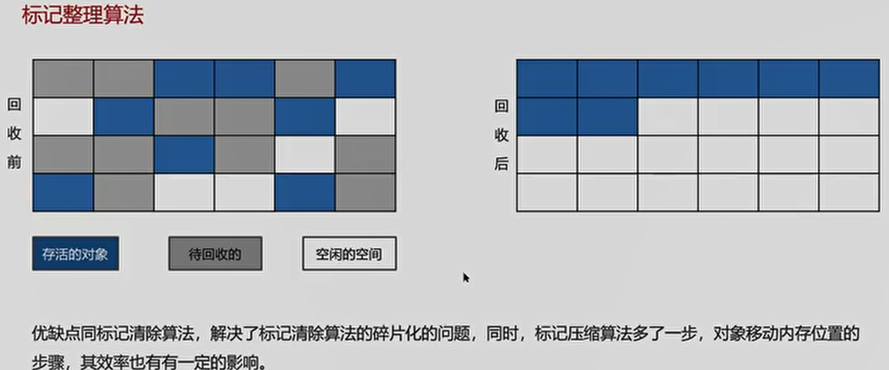
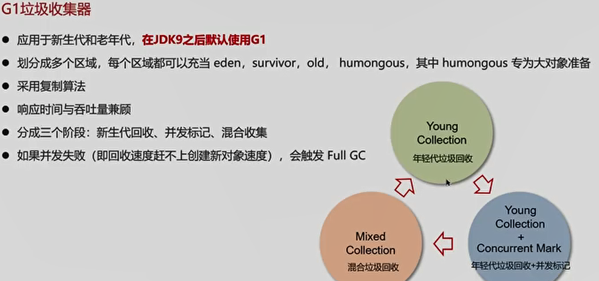
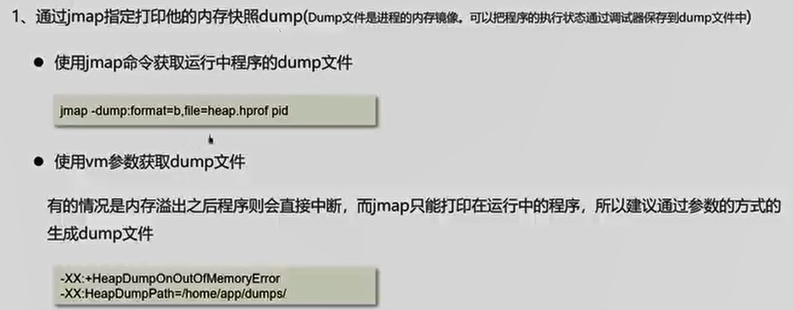

# JVM组成

- 类加载器：用于装载字节码文件（.class文件）
- 运行时数据区：用于分配存储空间
- 执行引擎：执行字节码文件或本地方法
- 垃圾回收器：用于对JVM中的垃圾内容进行回收
## 程序计数器
- 线程私有的，每个线程一份，内部保存的字节码的行号，用于记录正在执行的字节码指令的地址
  

## 堆
**线程共享的区域：主要用来保存对象实例、数组等，当堆中没有内存空间可分配给实例，也无法再扩展时，则抛出OutOfMemoryError异常**
- 存储对象和数组
  
## =========

## 虚拟机栈

## ======

## 方法区

## 常量池

## ===

## 直接内存
### BIO

### NIO

## ===

# 类加载器

### 双亲委派模型

## ===

## 类装载的过程

### 加载

### 验证

### 准备

### 解析

### 初始化

### 使用

### 卸载
**用户程序代码执行完毕以后，JVM就会销毁创建的CLASS对象**

### ====

# 垃圾回收

## 对象什么时候可以被垃圾器回收

## ====

## 定位垃圾的方法
### 引用计数法

### 可达性计数法

## JVM垃圾回收算法有哪些
### 标记清楚算法

### 标记整理算法（老年代）

### 复制算法（新生代）

## ======

## JVM中的分代回收

## MinorGC、MixedGC、FullGC区别

## =====

## JVM有哪些垃圾回收器
### 串行垃圾回收器

### 并行垃圾回收器

### CMS（并发）垃圾回收器

### G1垃圾回收器
**JDK9 以后默认**
**新生代回收、并发标记、混合收集**

#### 年轻代垃圾回收

#### 混合垃圾回收

#### ====

## ====

### 强引用、软引用、弱引用、虚引用区别

### ===

# JVM实践
## JVM 调优的参数在哪设置
- war包部署在tomcat中设置
  
- jar包部署在启动参数设置
  

## ===

## JVM调优参数
### 设置堆空间大小

### 虚拟机栈的位置

### 年轻代中Eden区和两个Survivor区的大小比例

### 年轻代晋升老年代阈值

### 设置垃圾回收收集器

## ===

## JVM调优工具
**命令工具**
### jps
**进程状态信息**

### jstack
**查看java进程内线程的堆栈信息**

### jmap
**查看堆转信息**

###  jhat
**堆转存储快照分析工具**
### jstat
**JVM统计监测工具**
**可视化工具**

### jconsole
**用于对jvm的内存、线程、类的监控**

### VisualVM
**能够监控线程、内存情况

## ===

## Java内存泄露的排查思路

## ====

## CPU飙高排查方案与思路

## ====

1.top
2.ps H -eo pid,tid,%cpu | grep 2266
3.jstack 2266
4.printf "%x\n" 2266
5.ls
6.cat Application.java