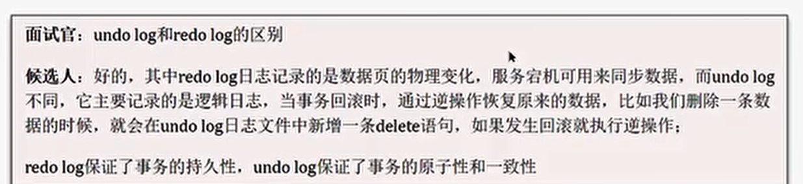

# 如何定位慢查询

## 采用运维工具

## 开启慢日志查询

==============

## SQL慢 如何分析
- 聚合查询
- 多表查询
- 表数据量过大查询
- 深度分页查询

- possible_keys 当前sql可能会使用到的索引
- key当前sql实际命中的索引
- key_len 索引占用的大小
- Extra 额外的优化建议
- type这条sql的连接的类型，性能由好到差为NULL、system、const、eq_ref、ref、range、index、all
  

=====================

# 索引
## 底层数据结构
**B+树**
B+树 所有数据都存储在叶子节点上，非叶子节点只存储指针

==============

## 聚簇索引

## 非聚簇索引

## 回表查询
先通过二级索引拿到对应的主键值，再到聚集索引查找整行数据

=================

## 覆盖索引
指  查询使用了索引， 并且需要返回的列，在该索引中已经全部能够找到
- 使用id查询，直接走聚集索引查询，一次索引扫描，直接返回数据，性能高
- 如果返回的列中没有创建索引，有可能会触发回表查询，尽量避免使用select*

## MySQL超大分页处理
- 优化思路： 一般分页查询时，通过创建 **覆盖索引** 能够比较好的提高性能，可以通过**覆盖索引加子查询**形式进行优化
  ===============
  

## 索引创建原则
- 

- 
  =================
  

## 索引失效
- 违反‘最左前缀原则’
- 范围查询右边的列，不能使用索引
  
- 不要在索引列上进行运算操作，索引失效
- 字符串不加单引号，造成索引失效
- 以%开头的Like模糊查询，索引失效，如果仅仅是尾部模糊匹配，索引不会失效，头部模糊匹配失效
- 
  =============
  

# SQL优化
- 表的设计优化
- 索引优化  （参考优化创建原则和索引失效）
- SQL语句优化
- 主从复制、读写分离
- 分库分表
  ===================
  

# 事务
事务是一组操作的集合，它是一个不可分割的工作单位，事务会把所有的操作作为一个整体一起向系统提交或撤销操作请求，即这些操作要么同时成功，要么同时失效
## 事务的特性-ACID

=================

## 并发事务
- 并发事务问题：脏读、不可重复读、幻读
- 隔离级别：读未提交、读已提交、可重复读、串行化
  ============
  

## undo log 和redo log 的区别

## MVCC
- 多版本并发控制
  -================
  

# MySQL主从同步原理
主从复制的核心 就是 二进制日志 binlog

============

# 分库分表
分担了访问压力，解决存储压力

## 垂直拆分
### 垂直分库

### 垂直分表

## 水平拆分
### 水平分库

### 水平分表

## 分布式事务

================
