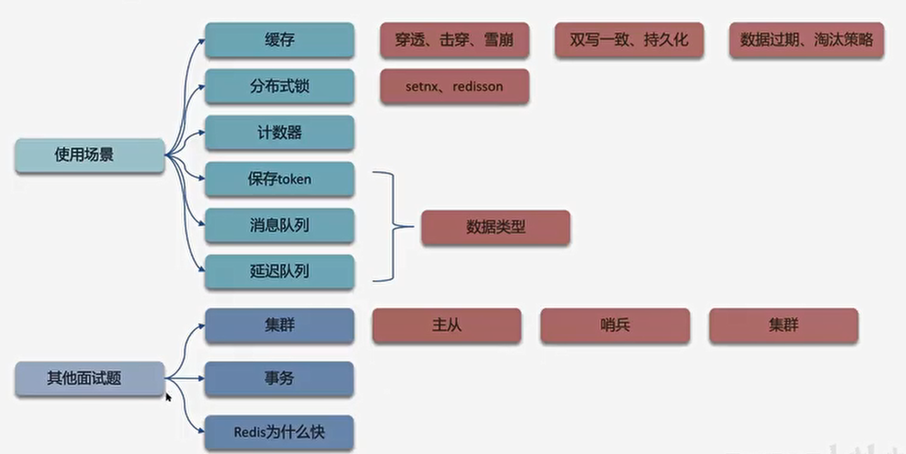
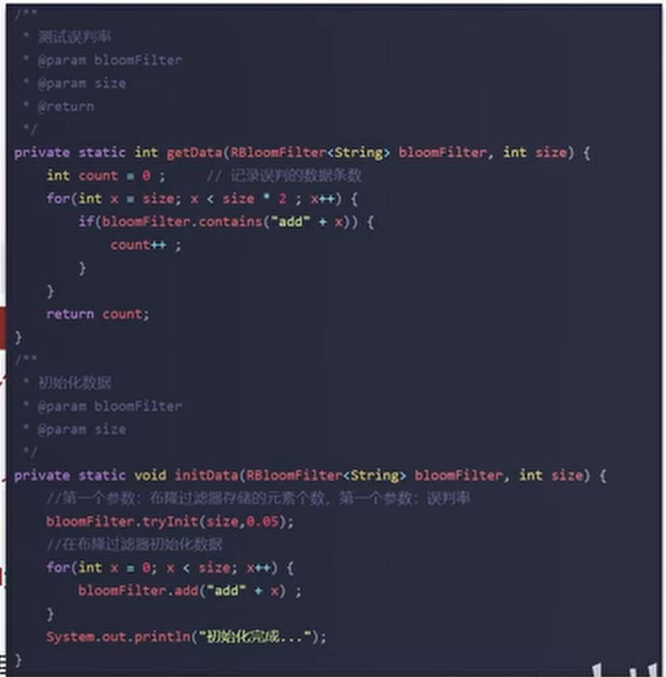
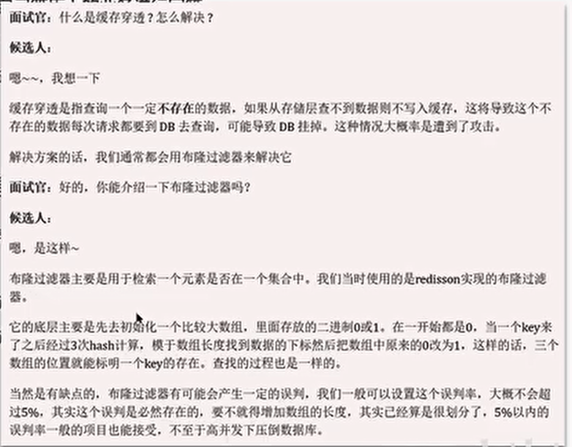
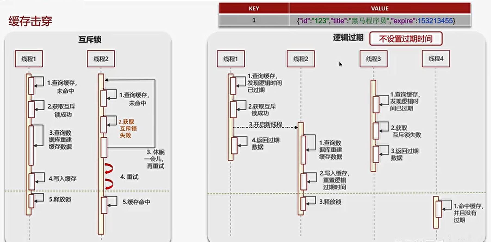
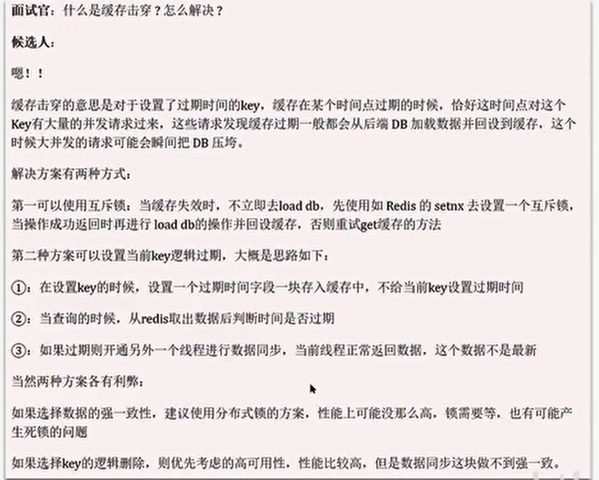
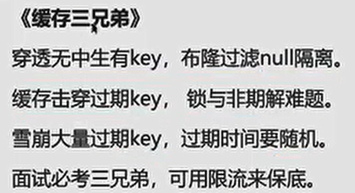

# 使用场景

 
# 缓存三兄弟（穿透、击穿、雪崩）、双写一致、持久化、数据过期策略、数据淘汰策略

## 缓存穿透
查询一个不存在的数据，mysql查询不到数据也不会直接写入缓存，就会导致每次请求都查数据库
### 解决方案一： 缓存空数据，查询返回的数据为空，仍把空结果进行缓存
- 优点简单，
- 缺点 消耗内存，可能会发生不一致的问题）
### 解决方案二： 布隆过滤器    
-优点：内存占用较少，没有多余key
- 缺点： 实现复杂，存在误判
- 布隆过滤器实现方案
-- Reddison
-- Guava
- 存在误判率：数组越小误判率就越大，数据越大误判率就越小，但同时带来更大的内存消耗
- 一般设置在0.05

=====

## 缓存击穿
给某一个key设置了过期时间，当key过期的时候，恰好这时间点对这个key有大量的并发请求过来，这些并发请求可能会瞬间把DB压垮
### 解决方案一： 互斥锁  （强一致、性能差）
### 解决方案二： 逻辑过期 （高可用，性能优，不保证数据绝对一致）

=========
 

## 缓存雪崩
缓存雪崩是指在同一时段大量的缓存key同时失效 或者Redis服务宕机，导致大量请求到达数据库，带来巨大压力
### 解决方案
- 给不同的Key的TTL 添加随机值
- 利用Redis集群提高服务的可用性（哨兵模式、集群模式）
- 给缓存业务添加降级限流策略 （**降级可作为系统的保底策略，适用于  穿透 、击穿、雪崩**）
- 给业务添加多级缓存
=============

# 分布式锁 
setnx 、redisson

