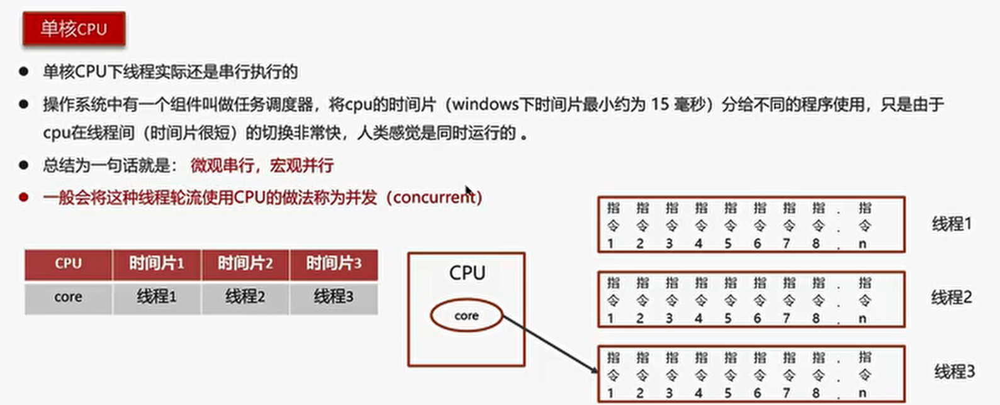
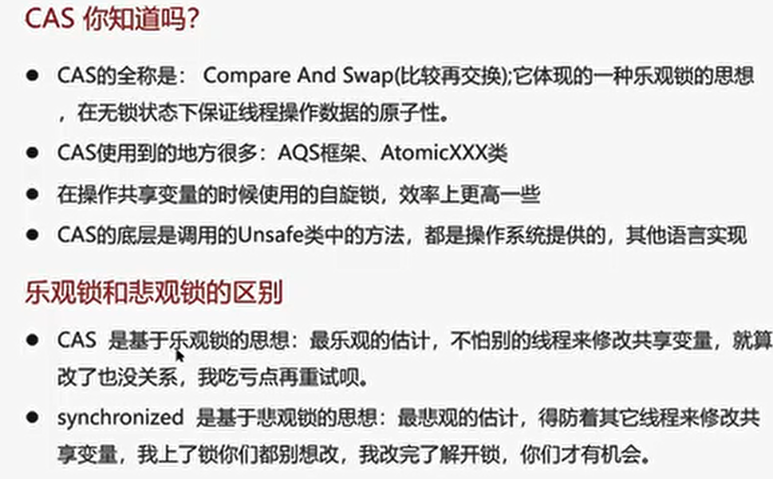

# 线程基础
## 线程和进程

## 并行和并发

## 创建线程的方式
- 继承Thread类
  
- 实现Runnable接口
  
- 实现Callable接口
  
- 线程池创建线程（项目中使用方式）
  

### Runnable和 Callable区别

### 线程的run() 和 start()区别

## ============

## 线程的状态

## ===========

## 新建T1、T2、T3三个线程，保证顺序执行

## notify() 和 notifyAll()区别
- notifyAll: 唤醒所有wait的线程
- notify：只随机唤醒一个wait线程

## java中的wait和sleep方法区别

## 如何停止一个正在运行的线程

# 线程中并发安全

## sychronized关键字的底层原理

### ==========

### 对象的内存结构

### MarkWord

### Monitor重量级锁

### 轻量级锁

### 偏向锁

### ============

## JMM

### ======

## CAS

### =======

## volatile
一旦一个共享变量（类的成员变量、类的静态成员变量）被volatile修饰之后，具备了两层语义
- 保证线程间的可见性

**用volatile修饰共享变量，能够防止编译器等优化发生，让一个线程对共享变量的修改对另一个线程可见

-  禁止进行指令重排序
   
## ==========

## AQS

## =========

## ReentrantLock的实现原理

### 利用CAS+ AQS队列来实现

## ===========

## sychronized和Lock区别

## 死锁
- 一个线程需要同时获取多把锁，这时就容易发生死锁

### 死锁诊断
**jps 和 jstack**
- jps：输出JVM中运行的进程状态信息
- jstack：查看java进程内线程的堆栈信息
  
  
## ========

## ConcurrentHashMap

## =======

## 导致并发程序出现问题的根本原因
Java并发编程三大特性
- 原子性
-  Sychronized：同步加锁
- JUC里面的lock：加锁
  
- 可见性
  
- 有序性
  
## ========

# 线程池
## 说一下线程池的核心参数

## 线程池的执行原理

## 线程池中有哪些常见的阻塞队列

## 如何确定核心线程数

## ========

## 线程池的种类
1.创建使用固定线程数的

## =========

## 为什么不建议用Executor创建线程池

## 线程池使用场景（CountDownLatch、Future）
### CountDownLatch

## 多线程使用场景一（es数据批量导入）

## 多线程使用场景二（数据汇总）

**Future**

## 多线程使用场景三（异步调用）

## ===========

## 如何控制某个方法允许并发访问线程的数量
### Semaphore
**信号量**

## 对ThreadLocal的理解

### ThreadLocal的实现原理

### ThreadLocal-内存泄露问题

## ======
