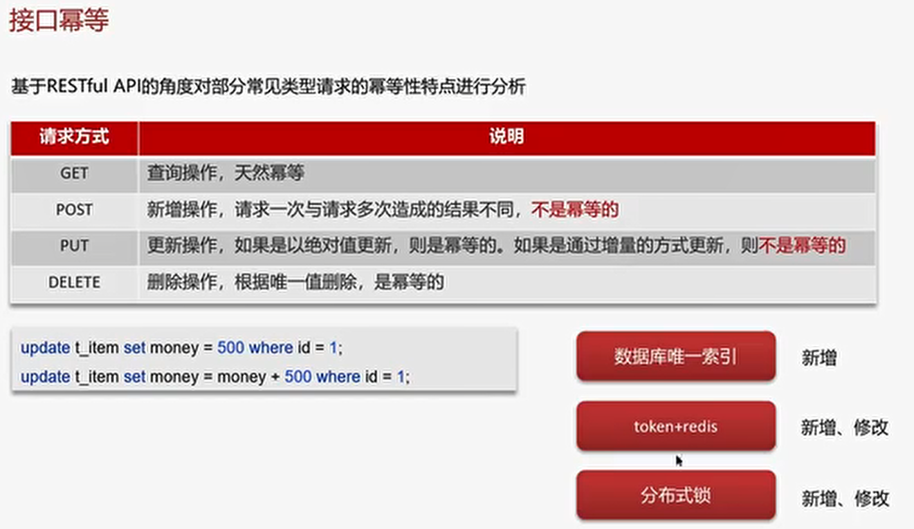

# SpringCloud 五大组件有哪些
- Eureka ：注册中心
- Ribbon：负载均衡
- Feign：远程调用
- Hystrix：服务熔断
- Zuul/Gateway：网关

# 服务注册和发现，SpringCloud如何实现服务注册发现
- 微服务中必须要使用的组件
- 常见的注册中心：Eureka、Nacos、Zookeeper
  

# Nacos

# Ribbon

# Hystrix
## 服务雪崩

## 服务降级

## 服务熔断

# 监控
为什么需要监控
- 问题定位
- 性能分析
- 服务关系
- 服务告警

工具
- SpringBoot-admin
- prometheus+ Grafana
- zipkin
- skywalking      这两个是链路追踪工具

## skywalking
- 
## ==============

# 限流

## Nginx限流
- 控制速率（突发流量）
  
- 控制并发连接数
  

## 网关限流

## ===================

限流常见算法：漏桶算法、令牌桶算法

# CAP
一致性、可用性、分区容错性
CP 一致性
AP 可用性

## =============

# 分布式事务
## Seata架构

### XA模式

### AT模式 （高可用模式-常用）

### TC模式

## MQ分布式事务
- 

## ==========================

# 分布式服务的接口幂等性
幂等： 多次调用方法或者接口不会改变业务状态，可以保证重复调用的结果和单次调用的结果一致

场景：
- 用户重复点击
- MQ消息重复
- 应用使用失败或超时重试机制
  

## token+ redis
通过创建token 保存到redis 来保证接口的幂等

## 分布式锁

## ================

# 分布式任务调度

## xxl-job
- 解决集群任务的重复执行问题
- cron表达式定义灵活
- 定时任务失败了，重试和统计
- 任务量大，分片执行
### 路由策略

### 任务执行失败怎么解决

### 大数据量的任务同时执行
- 分片广播
  

## ### ====================
