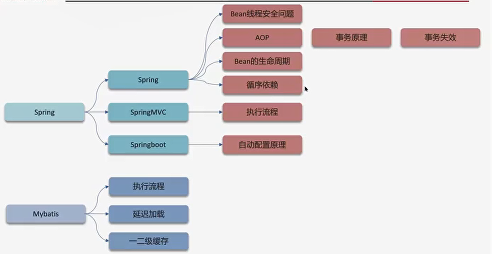

# Spring
## 单例
============
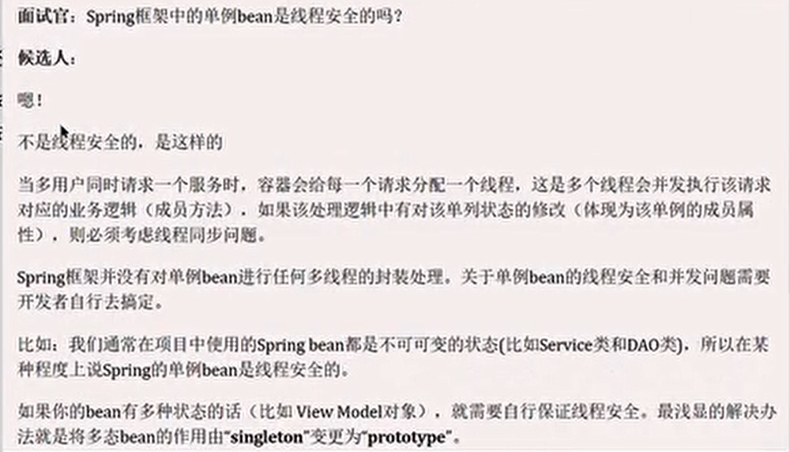

## AOP
面向切面编程
Spring管理的事务 底层用的就是AOP，AOP 的底层用的是动态代理

### 使用场景
- 记录操作日志
- 缓存处理
- Spring中内置的事务处理
  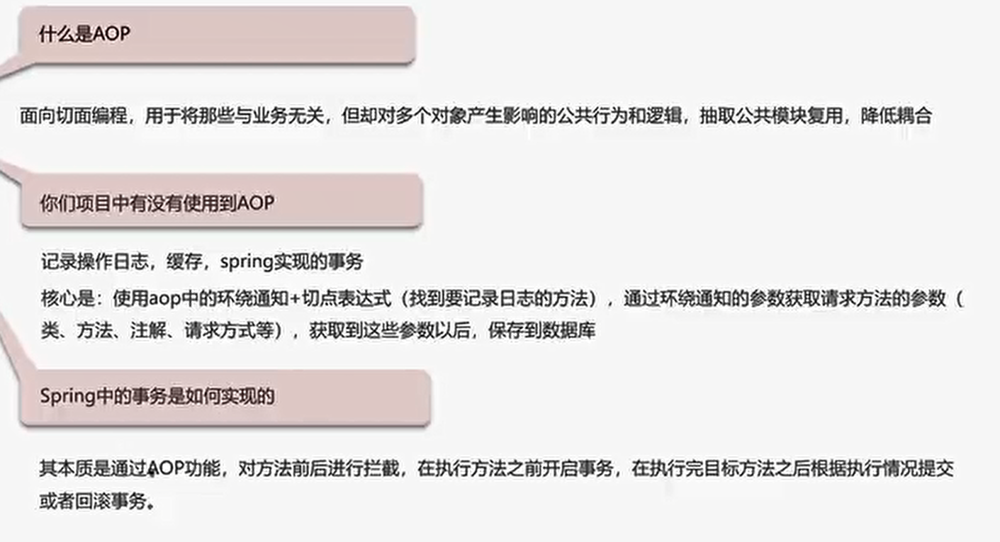

## 事务失效
- 异常捕获处理
  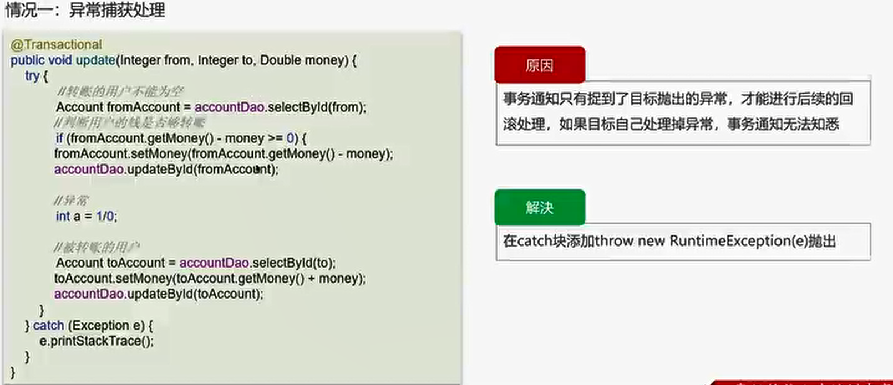
- 抛出检查异常
  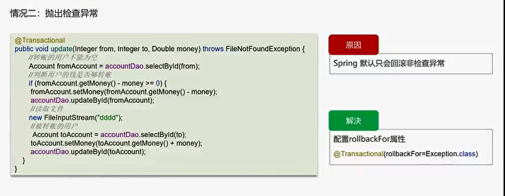
- 非public方法
  
  =============
  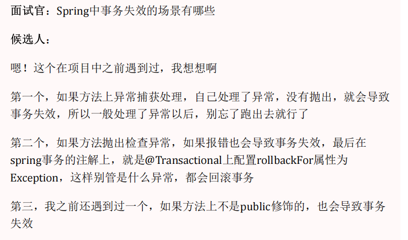
## Bean 的生命周期
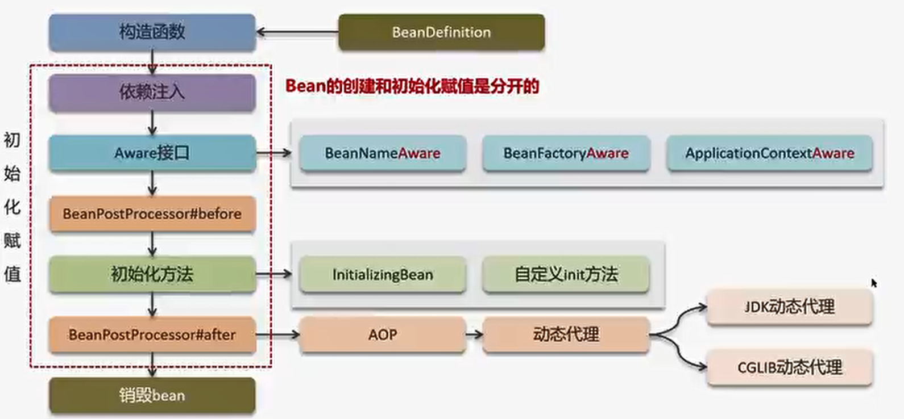
===========
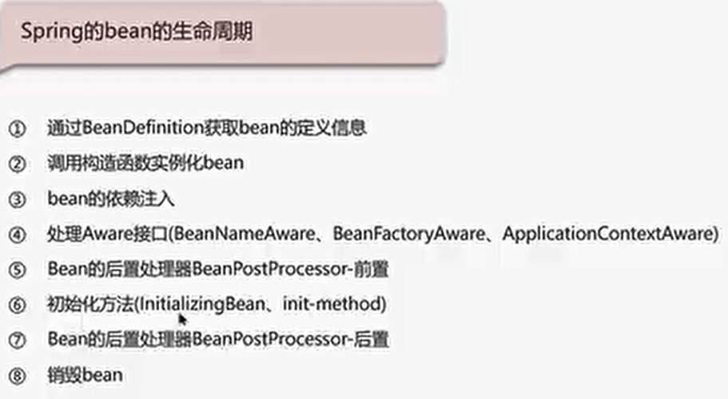
## 循环引用

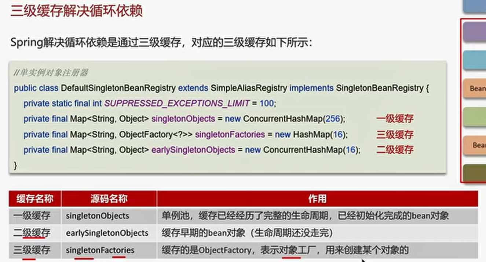

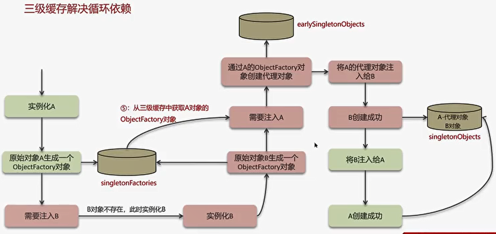
================
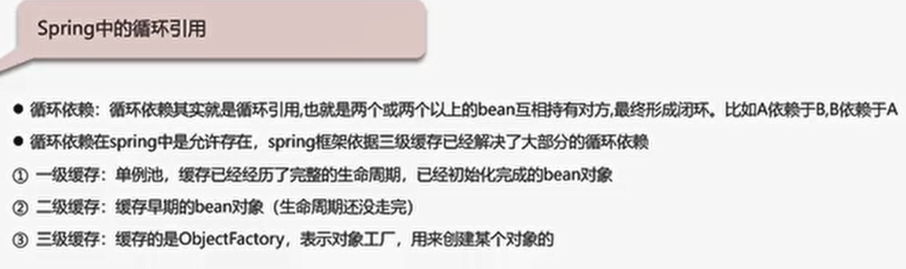
## SpringMVC的执行流程

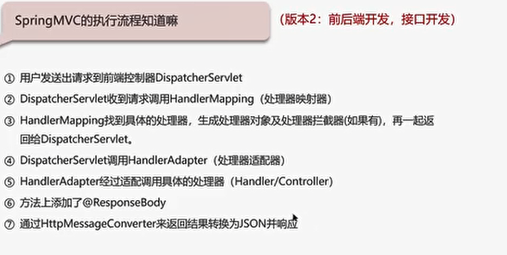
## SpringBoot 自动配置原理
-
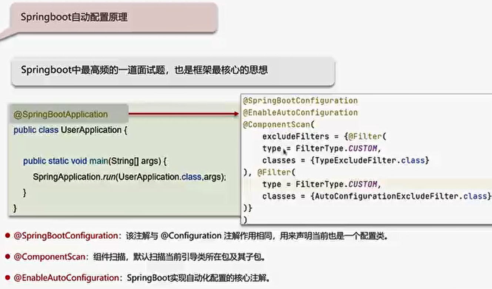
===================
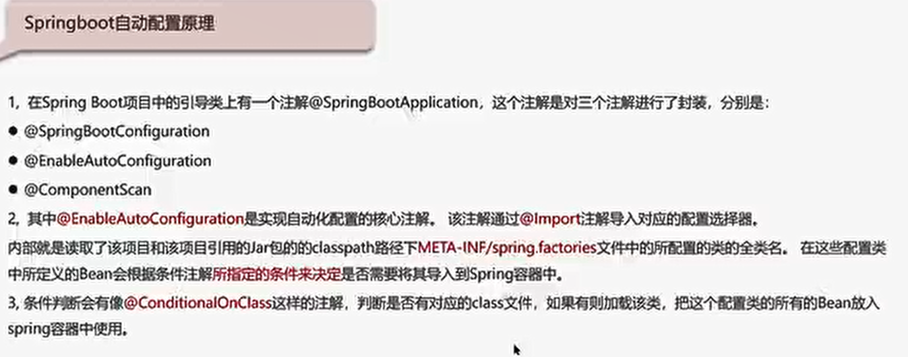

## Spring框架 常见注解
### Spring常见注解
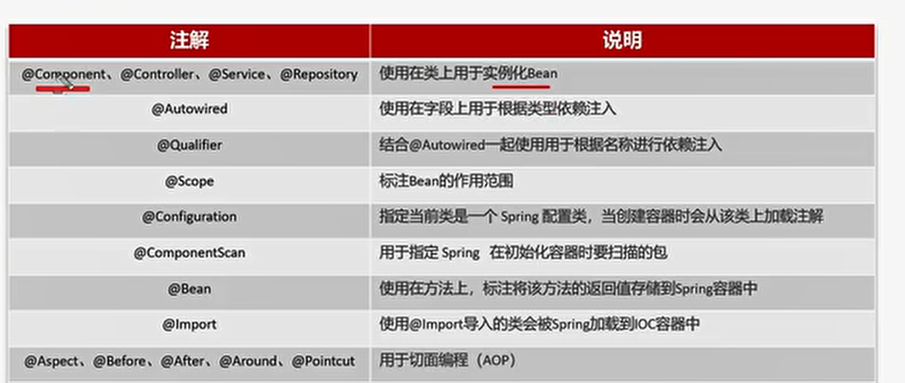

### SpringMVC常见注解

### SpringBoot常见注解
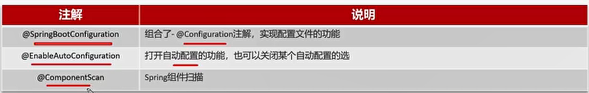

# Mybatis执行流程
-
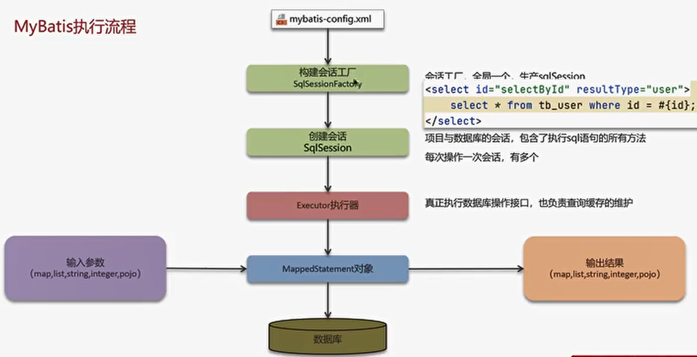
===================
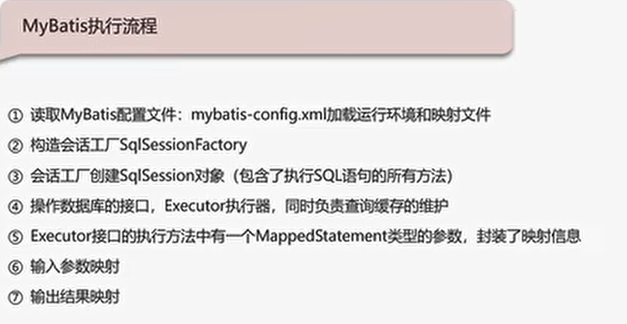

## Mybatis是否支持延迟加载

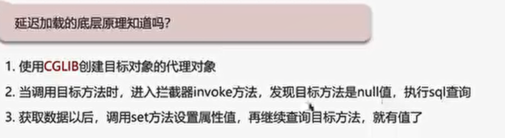

## Mybatis的一级、二级缓存用过吗

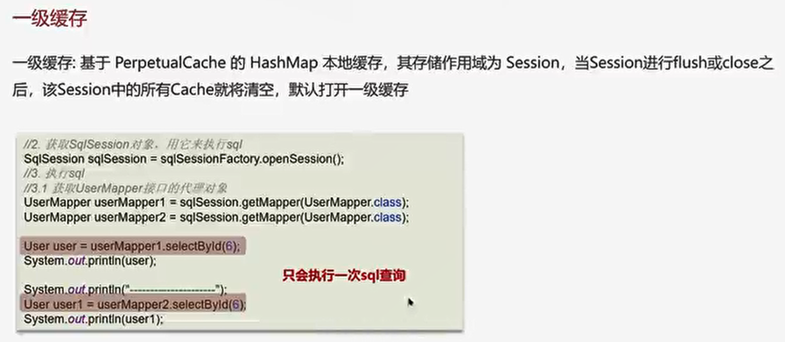
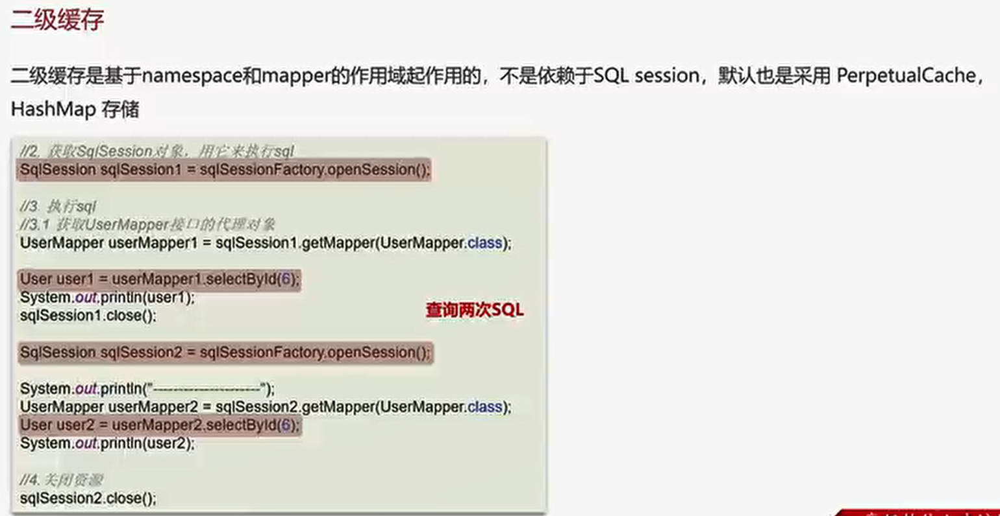

========================
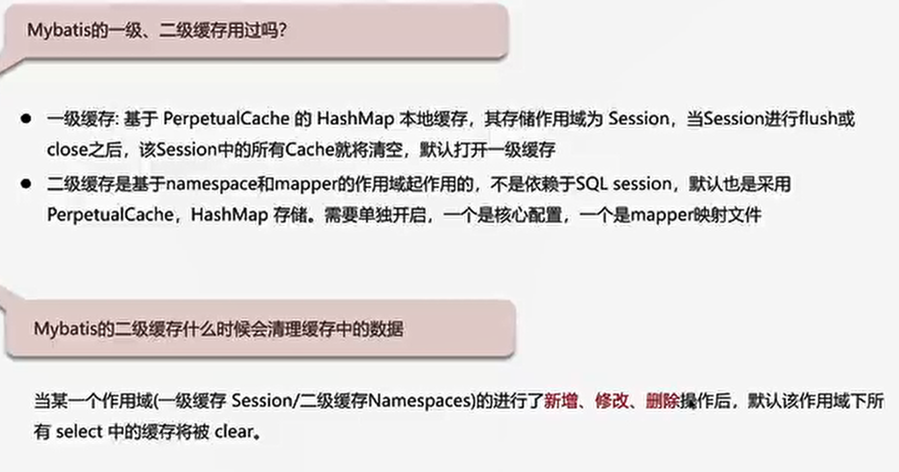
