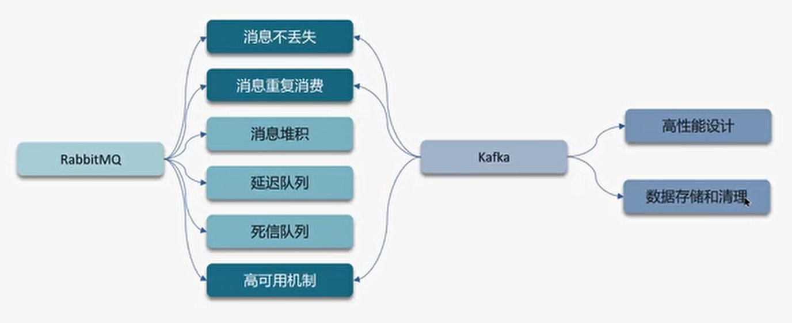

# RabbitMQ
## 如何保证消息不丢失

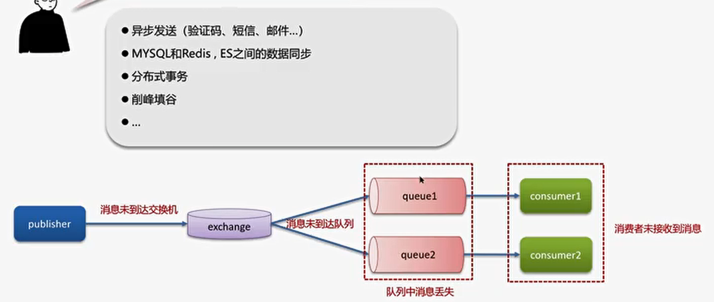
### 生产者确认机制
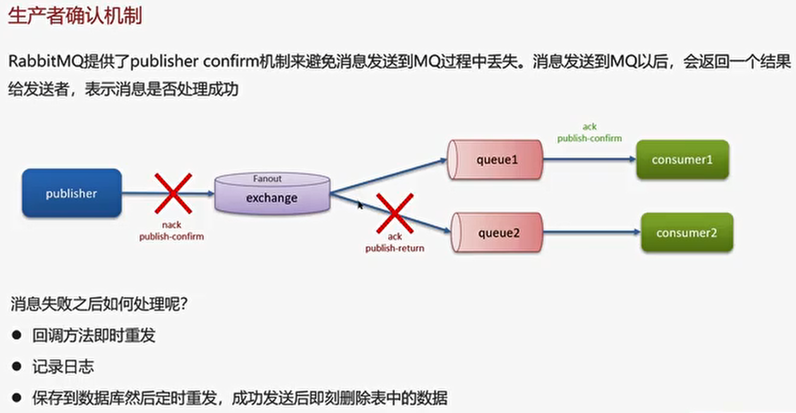
### 消息持久化

### 消费者确认
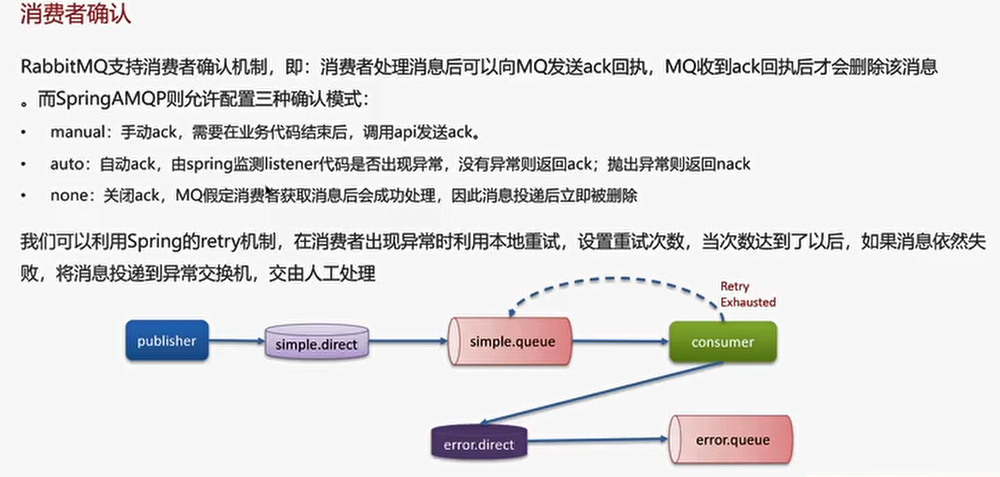
### ===============
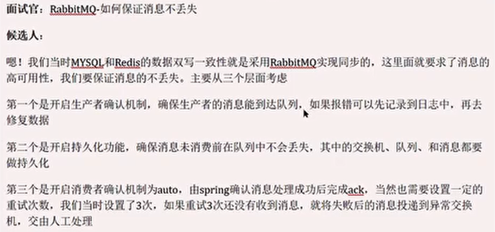

## RabbitMQ 消息的重复消费问题
- 每条消息设置一个唯一的标识id
- 幂等方案：【分布式锁、数据锁（悲观锁、乐观锁）】
  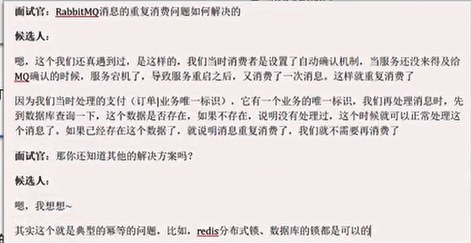

## RabbitMQ中死信交换机（RabbitMQ延迟队列）
延迟队列 = 死信交换机+ TTL（生存时间）
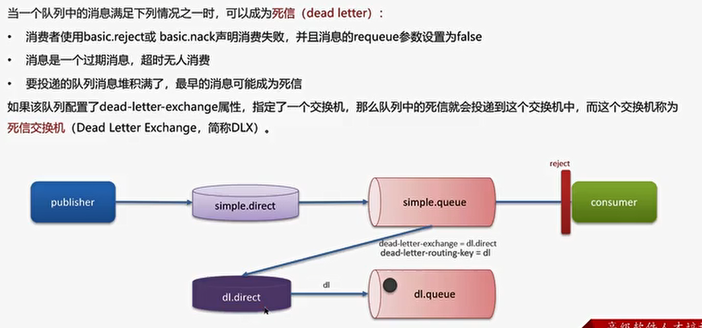
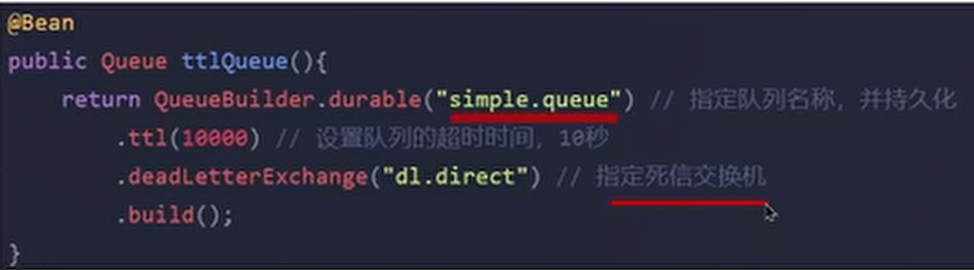
## ========

## RabbitMQ如果有100万消息堆积在MQ，如何解决
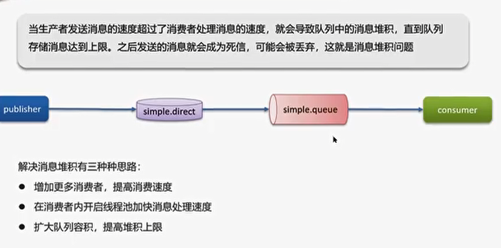
## ==========

## RabbitMQ的高可用机制
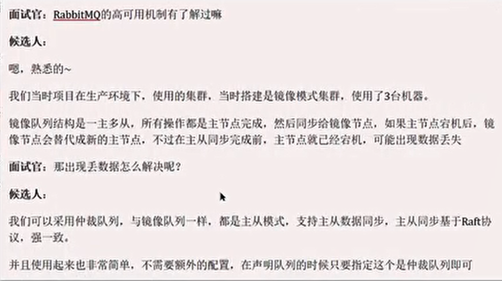

# Kafka

## 如何保证消息不丢失
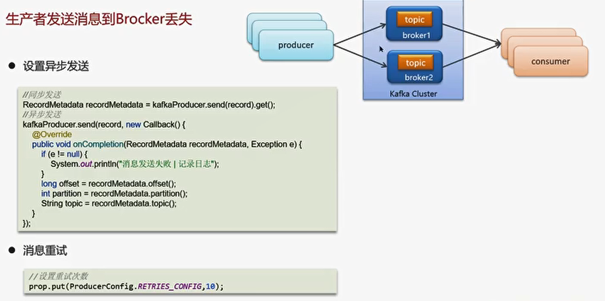
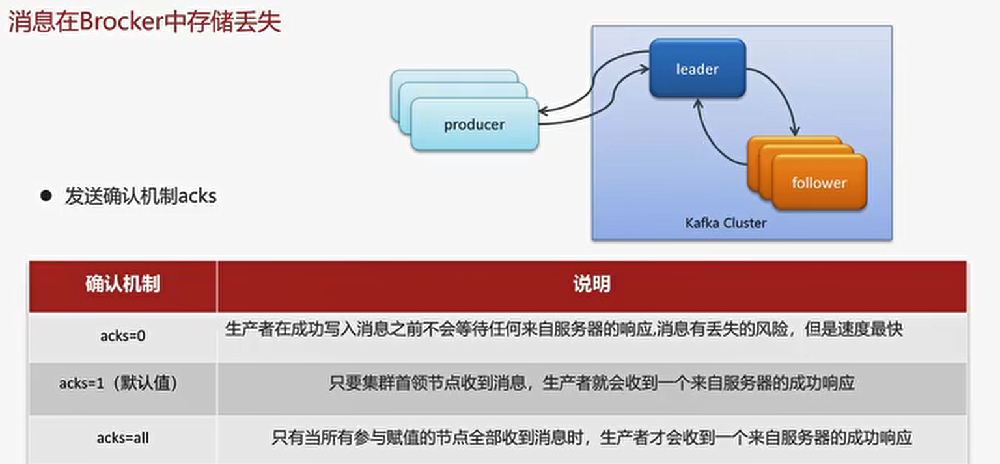
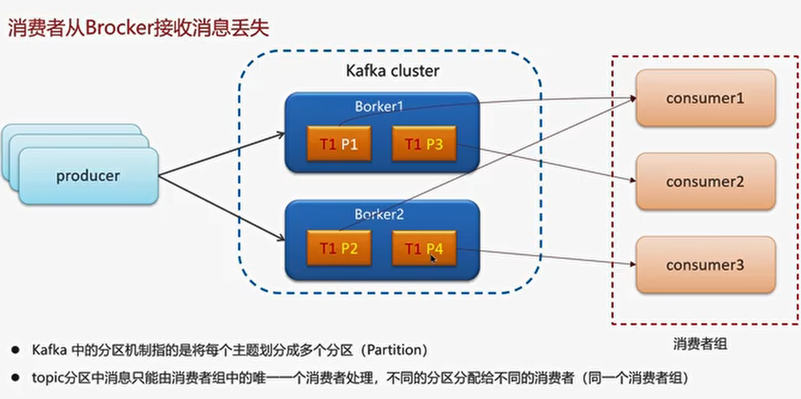
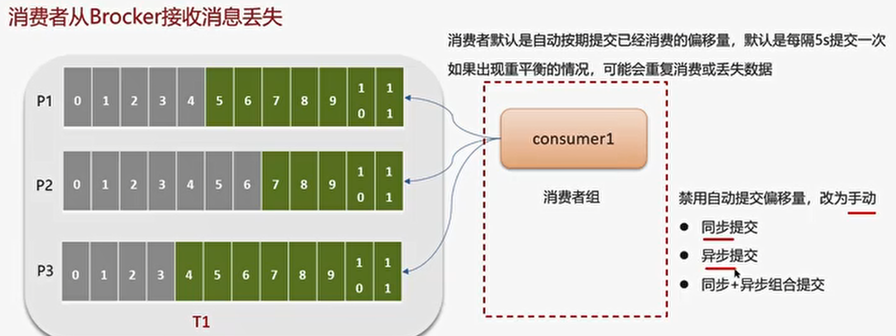
异步提交 + 同步提交的方式 保证
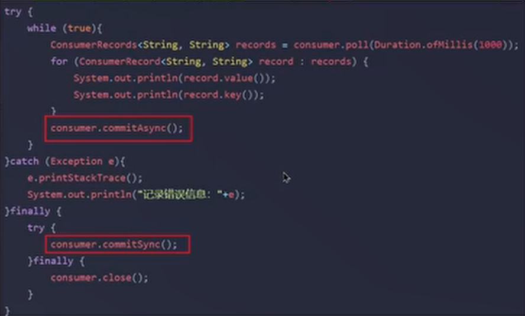

## ==================
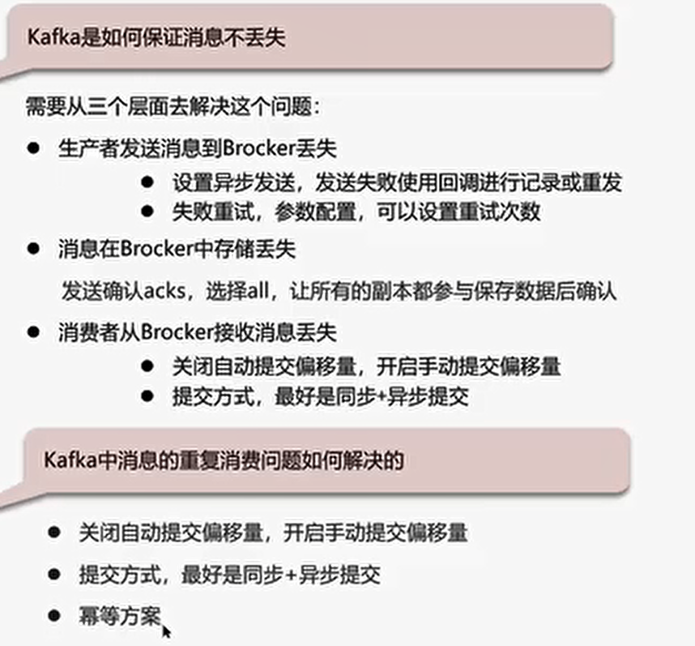

## 如何保证消息的顺序性
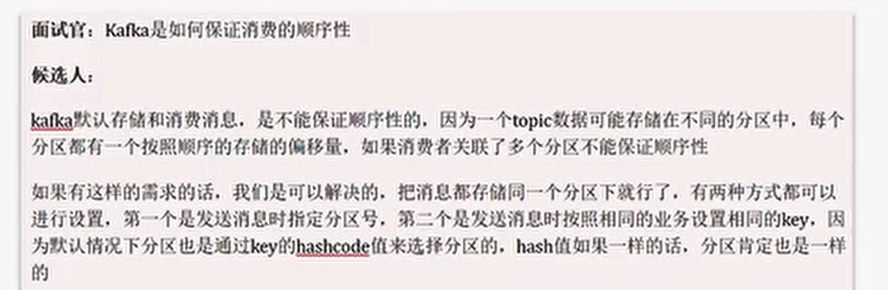
## Kafka的高可用
### 分区备份机制

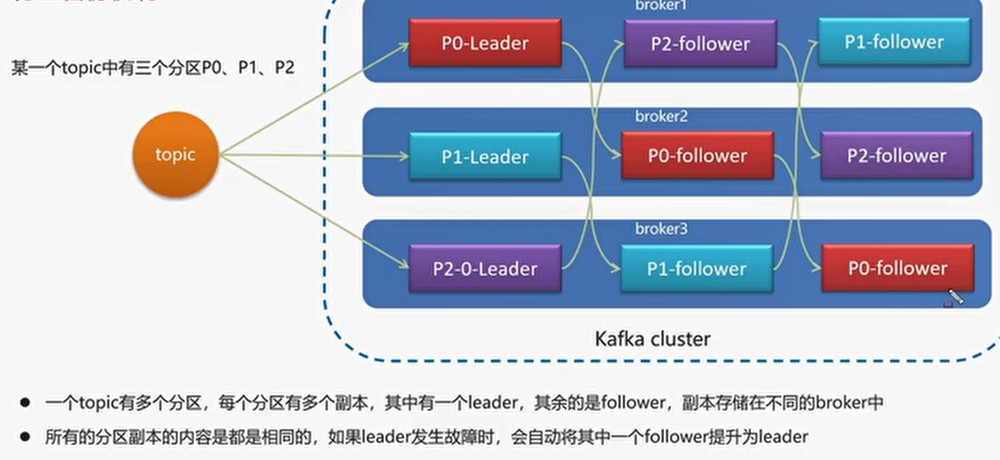
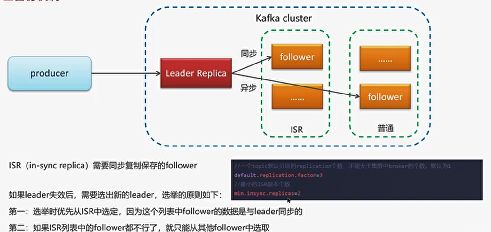

## =============

## Kafka数据清理机制
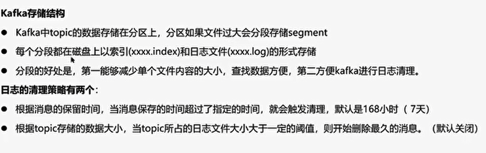

## Kafka 中实现高性能的设计
