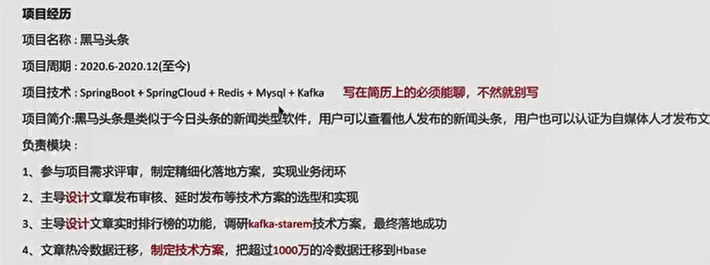
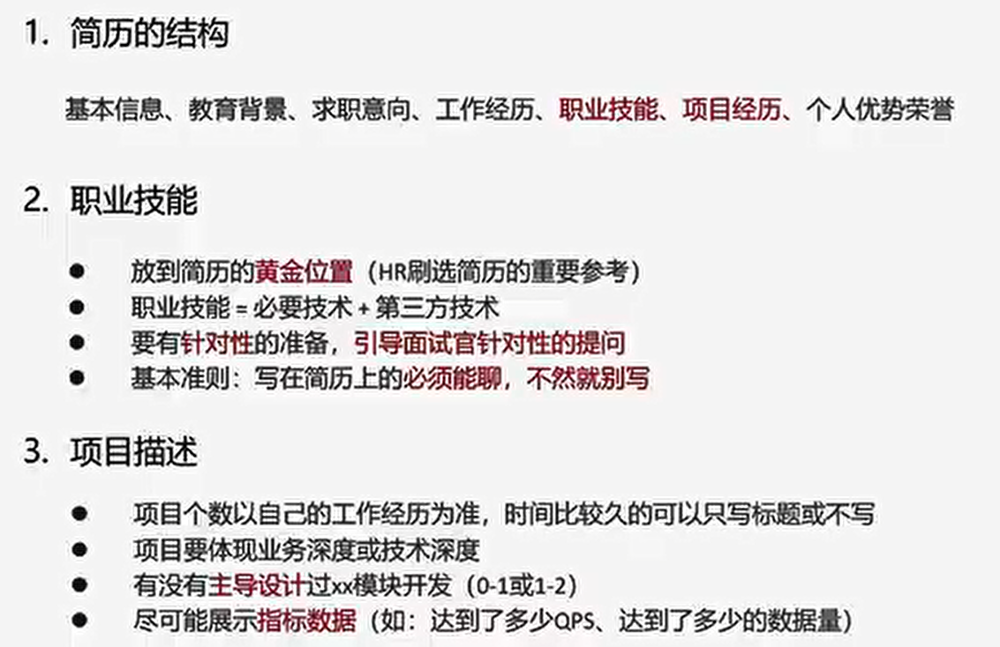

# 职业技能 
- 放到简历的黄金位置（HR 刷选简历的重要参考）
- 基本准则：写在简历上的必须能聊，不然就别写
- 参考公式：职业技能 = 必要技术 + 其他技术
    5年以上：（springboot + ssm +redis + 数据库） + 技术（微服务、ES、MQ、源码、高并发、jvm、技术选型、设计能力）
- 针对性的引导面试官（让他问一些你想让他问的）

# 项目经历
- 项目个数以工作经历为准
- 项目要体现业务深度或技术深度
- 有没有主导设计过xx模块开发（0-1或1-2）
- 尽可能展示指标数据（如：达到了多少QPS、达到了多少的数据量）
- 

