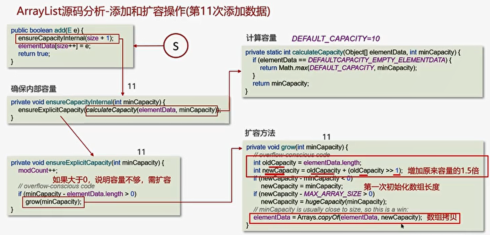
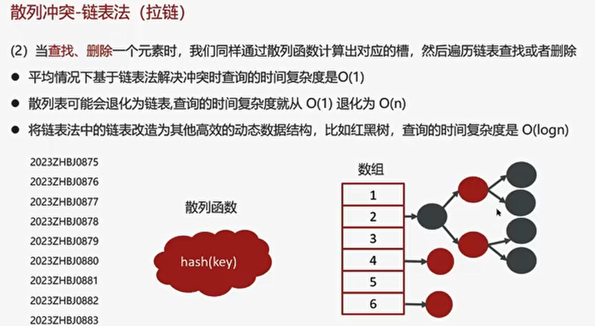

# 数据结构
- 数组
- 链表
- 二叉树
- 红黑树
- 散列表

# 时间复杂度
**复杂度分析就是要弄清楚代码的执行次数和数据规模n之间的关系**

## O(1)

## O(n)  O(n2)

## O(log n)

# 空间复杂度

空间复杂度全称是渐进空间复杂度，表示算法占用的额外存储空间与数据规模直接的增长关系

# 数组
## 数组的时间复杂度（查找）

## ArrayList 源码分析
### 第一次添加数据

### 第十一次添加数据

### ArrayList底层的实现原理

## 如何实现数组和List之间的转换

# 链表
## 单向链表
### **时间复杂度分析**
#### 查询

#### 插入\删除

## 双向链表

### **时间复杂度分析**

**时间复杂度分析**

# ArrayList和LinkedList的区别

# HashMap
- 二叉树
  
  
  
- 红黑树
  
  
  
- 散列表
  
  

#### 散列冲突-链表法-时间复杂度
**插入操作**   O(1)

将链表法中的链表改造红黑树 可以防止DDos攻击
## ===============

## HashMap的实现原理

## =============

## HashMap的put方法具体流程

## HashMap的扩容机制

## HashMap 的寻址算法

## HashMap在1.7 情况下的多线程死循环问题
