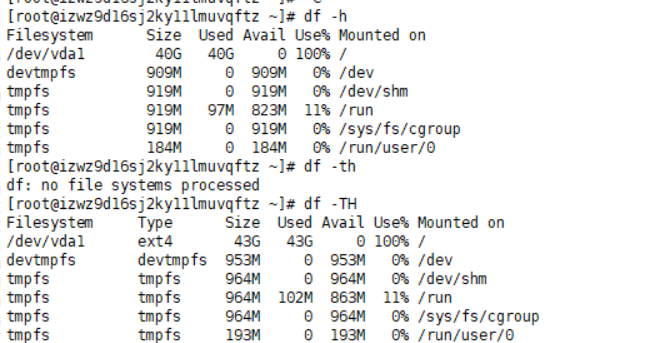
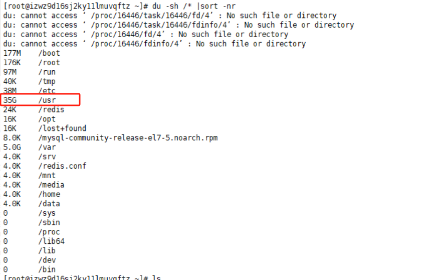
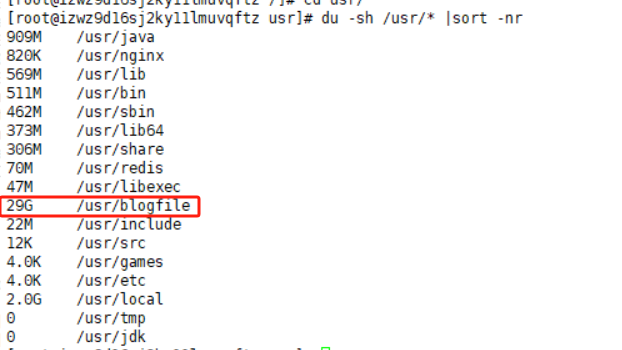
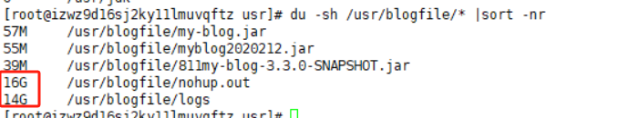

重置blog需安装软件 

blog待修改点 **微信扫码登录 消息队列 es全文检索、图片上传功能**

待学习知识点 springcloud dubbo +zookeeper 

多线程、分布式锁、分布式session

jdk8 lamda表达式、http知识点、学习写io流、

CollectionsUtils工具类的学习
- collect、filter等等

sql练习 牛客网刷题

Get请求方式不支持@RequestBody

## 做一个分布式的商城开发，在两个月之内

## 2019年6月23日20:32:51 天气热炸了

## 写一个网页版的聊天室 用websocket

## 学习数据库相关知识，索引以及更高级的知识

--------------------------

# blog linux 运行命令

# docker 命令
start/stop/restart
- docker start : 启动一个或多个已经被停止的容器。
- docker stop : 停止一个运行中的容器。
- docker restart : 重启容器。

## 启动docker
systemctl start docker 

# 启动已被停止的容器mynginx  
docker start mynginx  
# 停止运行中的容器mynginx  
docker stop mynginx  
# 重启容器mynginx  
docker restart mynginx

# kill 杀掉一个容器
# 根据容器名字杀掉容器  
docker kill tomcat7  
# 根据容器ID杀掉容器  
docker kill 65d4a94f7a39

# 容器操作命令
ps
列出容器。可选参数：

-a : 显示所有的容器，包括未运行的。
-f : 根据条件过滤显示的内容。
–format : 指定返回值的模板文件。
-l : 显示最近创建的容器。
-n : 列出最近创建的n个容器。
–no-trunc : 不截断输出。
-q : 静默模式，只显示容器编号。
-s : 显示总的文件大小。
## docker ps -a   查看docker 所有的容器
## docker logs mysql  查看mysql 打印日志
## 启动jar包  
nohup java -jar xxx.jar &    

## tail -f nohup.out   输出日志

## netstat -antp   查看所有端口

docker stats nginx1

# exec
在运行的容器中执行命令。可选参数：

-d : 分离模式: 在后台运行
-i : 即使没有附加也保持STDIN 打开
-t : 分配一个伪终端
- docker exec -it mysql bash
- docker exec -it redis bash

# docker run  创建一个新的容器 (-d 后台模式 -p绑定端口 -e指定environment -v数据挂载 --name名字 mysql:5.7指定镜像跟版本)
docker run -p 3306:3306 --name mysql -e MYSQL_ROOT_PASSWORD=root -d mysql
docker run -it -d --name mysqlblog -p3306:3306 -e MYSQL_ROOT_PASSWORD=root mysql

redis-cli -h localhost -p 6379 -a 532313 本地启动redis
redis-server redis.conf
redis-server /usr/redis/redis.conf
redis-server /usr/redis-4.0.9/redis.conf

service mysqld restart  
mysql -r root -p

## vim 编辑文件
insert 进入编辑状态
：wq 保存文件并退出vi

## cp 拷贝文件
docker cp 容器id:/etc/mysql/my.cnf .  拷贝到容器外
docker cp my.cnf 容器id:/etc/mysql    拷贝到容器里
-----------------------------------
# 定位阿里云博客启动失败
2023年12月10日23:17:47 博客重启一直失败
## df -h  检查磁盘内存
通过检查阿里云服务器 发现linux内存满了 导致 doker上 mysql redis全都启动失败

## du -sh /* |sort -nr
在根目录下 使用命令 查找所有文件和目录的大小排序结果

可以看到是usr 文件夹占用了超大内存

## du -sh /usr/* |sort -nr
继续使用 命令去定位usr 文件夹的问题

可以看到是 blogfile 文件 占用超过29G

最后发现是打印日志超过太多了 导致内存爆了！

## cat /dev/null >nohup.out 清除
用清空命令 删除文件内容